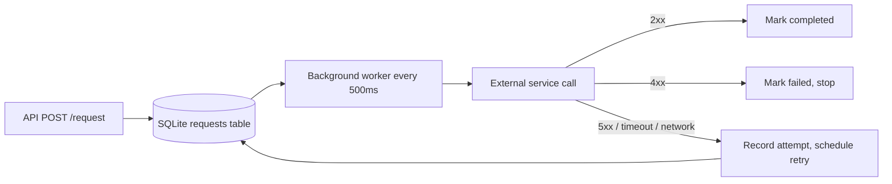
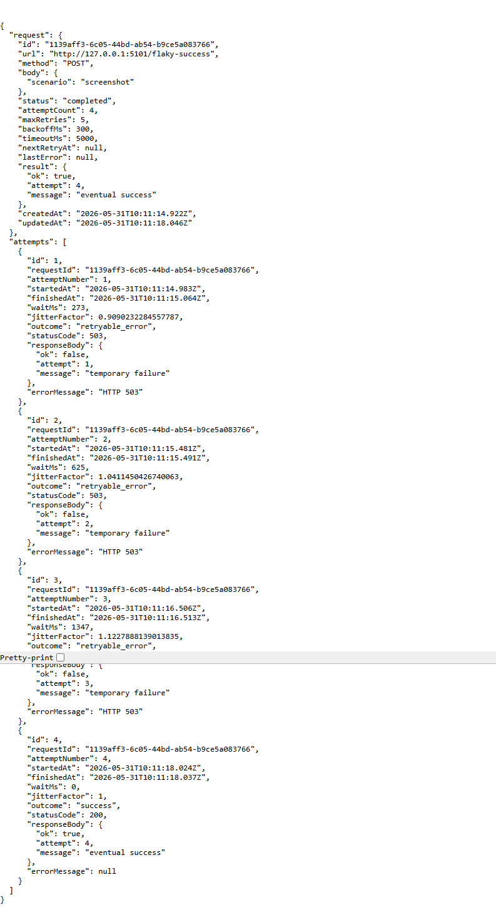

# Retry Engine

Small TypeScript HTTP service that accepts an outgoing request, retries it with exponential backoff and jitter, and stores the full attempt history in SQLite.

## Setup

```bash
npm install
npm run start
```

The server listens on `http://127.0.0.1:3000` by default.

To run the end-to-end demo against a mock flaky upstream:

```bash
npm test
```

## Project Structure

```text
src/
  persistence/
    retry-storage.ts
  retry-engine.ts
  server.ts
  demo.ts
  types.ts
  utils/
    http-utils.ts
    json-utils.ts
    worker-utils.ts
  validation/
    request-validation.ts
    url-safety.ts
```

The main retry engine stays in `src/retry-engine.ts`; the shared helpers live under `src/utils` and `src/validation` so the entrypoints stay small.

## Endpoints

Create a request:

```bash
curl.exe -X POST http://127.0.0.1:3000/request ^
  -H "content-type: application/json" ^
  -d "{\"url\":\"https://example.com/webhook\",\"method\":\"POST\",\"body\":{\"hello\":\"world\"},\"maxRetries\":5,\"backoffMs\":1000}"
```

If you are using Windows PowerShell, this form is usually easier to run:

```powershell
$body = @{ url = 'https://example.com/webhook'; method = 'POST'; body = @{ hello = 'world' }; maxRetries = 5; backoffMs = 1000 } | ConvertTo-Json -Depth 5
$response = Invoke-RestMethod -Method Post -Uri 'http://127.0.0.1:3000/request' -ContentType 'application/json' -Body $body
$response
```

Get one request and its attempts:

```bash
curl.exe http://127.0.0.1:3000/requests/<request-id>
```

PowerShell version:

```powershell
Invoke-RestMethod -Uri ("http://127.0.0.1:3000/requests/$($response.id)")
```

List requests by status:

```bash
curl "http://127.0.0.1:3000/requests?status=failed"
```

On PowerShell, use `curl.exe` instead of `curl`. If you use `curl`, PowerShell may route the command to `Invoke-WebRequest`, which does not accept the same flags.

The `maxRetries` field is the retry budget after the initial attempt. For example, `maxRetries: 2` allows up to 3 total attempts.

For local demos or localhost targets, set `ALLOW_PRIVATE_TARGETS=true` before starting the server. The demo script already enables private localhost targets internally. You can also set `ALLOWED_TARGET_HOSTS=api.example.com,webhook.example.com` to limit accepted hostnames.

If you want to use a local mock URL in the request body, start the server like this:

```powershell
$env:ALLOW_PRIVATE_TARGETS = 'true'
npm run start
```

## Retry Flow



## Core Concepts

Exponential backoff spreads retries out as failures continue. If an upstream is already struggling, retrying immediately just adds more load and increases the chance of a wider outage. Doubling the wait gives the system time to recover and reduces pressure on the dependency.

Jitter matters because many clients often fail at the same time. If every client retries on the exact same schedule, they all stampede the upstream together. Re-rolling a small random factor on every attempt breaks that synchronization and smooths traffic.

Not every error should be retried. 5xx responses, timeouts, and network errors usually mean the server or connection was transiently unhealthy, so retrying may succeed later. 4xx responses usually mean the request was invalid or unauthorized, so retrying the same payload would only repeat the failure.

## Screenshot

The request detail view with attempt history is saved here:



## What I Struggled With

The first friction point was getting the TypeScript runtime, the SQLite wrapper, and the native driver to agree on a Node module setup. I also had to correct the backoff math so retries really doubled rather than drifting into a fixed increment pattern.
Another subtle issue was avoiding duplicate processing while the worker woke up every 500ms. I solved that by keeping an in-process lock set and only updating the request row after each attempt finished.

I also had to tighten request validation after the first pass so invalid JSON, oversized bodies, and unsafe targets were rejected up front instead of being handled too late.

## What I Learned

I got more comfortable with using SQLite as an operational datastore for async work, especially with a separate attempts table instead of trying to cram every event into one row. I also learned how to structure a tiny worker loop so it stays simple but still behaves predictably under retry timing.

I now think more carefully about failure classes. A 4xx is not the same as a 5xx, and a retry policy that ignores that distinction can turn a small client bug into unnecessary load.

## Resources I Consulted

- [SQLite documentation](https://www.sqlite.org/docs.html)
- [MDN: Fetch API](https://developer.mozilla.org/en-US/docs/Web/API/Fetch_API)
- [MDN: AbortController](https://developer.mozilla.org/en-US/docs/Web/API/AbortController)
- [AWS architecture guidance on exponential backoff and jitter](https://aws.amazon.com/builders-library/timeouts-retries-and-backoff-with-jitter/)

## Why This Made Me a Better Backend Engineer

This project forced me to think like production software instead of a happy-path demo. I had to design for transient failure, persistence, dead-lettering, and observability of every attempt, not just the final outcome.

I'm now more deliberate about retry policies, worker scheduling, and state transitions. In a real fintech or e-commerce system, I’d be quicker to ask: should this error be retried, how do we avoid retry storms, and how do we prove what happened when something eventually fails?